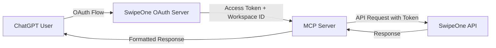

# OAuth Integration Strategy for Production

## Overview

This document outlines the strategy for implementing OAuth authentication in production, which will replace the current environment-based workspace ID approach used for testing.

---

## Current Implementation (Testing)

### How It Works

**For Testing/Development**:
- Workspace ID is set via `DEFAULT_WORKSPACE_ID` environment variable
- Tools accept optional `workspaceId` parameter
- If not provided, falls back to `DEFAULT_WORKSPACE_ID`
- Simple and works for local testing

**Configuration**:
```env
DEFAULT_WORKSPACE_ID=workspace_123
```

**Usage**:
```json
// Option 1: Omit workspaceId (uses DEFAULT_WORKSPACE_ID)
{
  "limit": 10
}

// Option 2: Provide workspaceId explicitly
{
  "workspaceId": "workspace_456",
  "limit": 10
}
```

---

## Production Implementation (OAuth)

### Architecture Overview



### OAuth Flow

#### 1. **User Authentication**
```
User clicks "Connect SwipeOne" in ChatGPT
  ↓
Redirected to SwipeOne OAuth page
  ↓
User logs in and grants permissions
  ↓
SwipeOne redirects back with authorization code
  ↓
MCP Server exchanges code for access token
  ↓
Token includes user's workspace ID(s)
```

#### 2. **Token Storage**
- **Access Token**: Short-lived (1 hour), used for API requests
- **Refresh Token**: Long-lived (30 days), used to get new access tokens
- **Workspace Context**: Stored with token, identifies user's workspace

#### 3. **Request Flow**
```typescript
// Each request from ChatGPT includes OAuth context
{
  "oauthContext": {
    "accessToken": "eyJhbGc...",
    "workspaceId": "workspace_abc123",
    "userId": "user_xyz789"
  },
  "toolName": "search_contacts",
  "arguments": {
    "filter": {...}
  }
}
```

---

## Implementation Changes Required

### 1. **Add OAuth Middleware**

Create `src/middleware/oauth.ts`:

```typescript
import { z } from 'zod';

// OAuth context schema
const oauthContextSchema = z.object({
  accessToken: z.string(),
  workspaceId: z.string(),
  userId: z.string(),
  expiresAt: z.number(),
});

export type OAuthContext = z.infer<typeof oauthContextSchema>;

// Validate and extract OAuth context from request
export function extractOAuthContext(request: any): OAuthContext | null {
  try {
    const context = request.meta?.oauthContext;
    return context ? oauthContextSchema.parse(context) : null;
  } catch {
    return null;
  }
}

// Verify token is not expired
export function isTokenValid(context: OAuthContext): boolean {
  return Date.now() < context.expiresAt;
}
```

### 2. **Update API Client for OAuth**

Modify `src/services/apiClient.ts`:

```typescript
class SwipeOneAPIClient {
  // Add method to set OAuth token dynamically
  setAuthToken(token: string) {
    this.client.defaults.headers.common['Authorization'] = `Bearer ${token}`;
  }

  // Remove static x-api-key, use OAuth token instead
  async getContactProperties(
    workspaceId: string,
    oauthToken?: string
  ): Promise<ContactPropertiesResponse> {
    if (oauthToken) {
      this.setAuthToken(oauthToken);
    }
    // ... rest of implementation
  }
}
```

### 3. **Update Tool Handlers**

Modify `src/index.ts`:

```typescript
server.setRequestHandler(CallToolRequestSchema, async (request) => {
  const { name, arguments: args } = request.params;
  
  // Extract OAuth context (production) or use env (testing)
  const oauthContext = extractOAuthContext(request);
  
  let workspaceId: string;
  let authToken: string | undefined;
  
  if (oauthContext && isTokenValid(oauthContext)) {
    // Production: Use OAuth workspace ID
    workspaceId = oauthContext.workspaceId;
    authToken = oauthContext.accessToken;
  } else {
    // Testing: Use environment variable
    workspaceId = args.workspaceId || serverConfig.defaultWorkspaceId;
    authToken = undefined; // Use API key from environment
  }
  
  if (!workspaceId) {
    return {
      content: [{
        type: 'text',
        text: 'Error: No workspace ID available. OAuth not configured or DEFAULT_WORKSPACE_ID not set.'
      }],
      isError: true,
    };
  }
  
  // Call API with workspace ID and optional OAuth token
  const response = await apiClient.getContactProperties(workspaceId, authToken);
  // ...
});
```

### 4. **Environment Configuration**

Update `src/config/environment.ts`:

```typescript
const envSchema = z.object({
  // API Key becomes optional in production (OAuth replaces it)
  SWIPEONE_API_KEY: z.string().optional(),
  SWIPEONE_API_BASE_URL: z.string().url().default('https://api.swipeone.com/api'),
  
  // OAuth Configuration (production only)
  OAUTH_CLIENT_ID: z.string().optional(),
  OAUTH_CLIENT_SECRET: z.string().optional(),
  OAUTH_REDIRECT_URI: z.string().url().optional(),
  
  // Testing fallback
  DEFAULT_WORKSPACE_ID: z.string().optional(),
  
  NODE_ENV: z.enum(['development', 'production', 'test']).default('development'),
});
```

---

## OAuth Endpoints to Implement

### SwipeOne OAuth Server Requirements

Your SwipeOne OAuth server needs to provide:

#### 1. **Authorization Endpoint**
```
GET https://auth.swipeone.com/oauth/authorize
  ?client_id=YOUR_CLIENT_ID
  &redirect_uri=https://your-mcp-server.com/oauth/callback
  &response_type=code
  &scope=workspaces:read contacts:read contacts:write
  &state=RANDOM_STATE_TOKEN
```

**Response**: Redirects to `redirect_uri` with authorization code

#### 2. **Token Endpoint**
```
POST https://auth.swipeone.com/oauth/token
Content-Type: application/json

{
  "grant_type": "authorization_code",
  "code": "AUTH_CODE_FROM_CALLBACK",
  "client_id": "YOUR_CLIENT_ID",
  "client_secret": "YOUR_CLIENT_SECRET",
  "redirect_uri": "https://your-mcp-server.com/oauth/callback"
}
```

**Response**:
```json
{
  "access_token": "eyJhbGc...",
  "refresh_token": "refresh_xyz...",
  "token_type": "Bearer",
  "expires_in": 3600,
  "workspace_id": "workspace_abc123",
  "user_id": "user_xyz789"
}
```

#### 3. **Token Refresh Endpoint**
```
POST https://auth.swipeone.com/oauth/token
Content-Type: application/json

{
  "grant_type": "refresh_token",
  "refresh_token": "refresh_xyz...",
  "client_id": "YOUR_CLIENT_ID",
  "client_secret": "YOUR_CLIENT_SECRET"
}
```

#### 4. **User Info Endpoint** (Optional)
```
GET https://auth.swipeone.com/oauth/userinfo
Authorization: Bearer ACCESS_TOKEN
```

**Response**:
```json
{
  "user_id": "user_xyz789",
  "email": "user@example.com",
  "workspaces": [
    {
      "id": "workspace_abc123",
      "name": "My Workspace",
      "role": "admin"
    }
  ]
}
```

---

## Migration Path

### Phase 1: Testing (Current)
✅ Use `DEFAULT_WORKSPACE_ID` from environment  
✅ Use API key authentication  
✅ Manual workspace ID specification  

### Phase 2: OAuth Preparation
- [ ] Implement OAuth middleware
- [ ] Update API client for token-based auth
- [ ] Add OAuth configuration to environment
- [ ] Create OAuth callback handlers

### Phase 3: OAuth Integration
- [ ] Register MCP server as OAuth client with SwipeOne
- [ ] Implement authorization flow
- [ ] Implement token refresh logic
- [ ] Add token storage (Redis/Database)

### Phase 4: Production Deployment
- [ ] Deploy MCP server with HTTPS
- [ ] Configure OAuth credentials
- [ ] Register with ChatGPT App platform
- [ ] Test end-to-end OAuth flow

### Phase 5: Hybrid Mode
- [ ] Support both OAuth (production) and API key (testing)
- [ ] Auto-detect authentication method
- [ ] Graceful fallback to environment variables

---

## Security Considerations

### 1. **Token Storage**
- **Never log tokens** in plain text
- **Encrypt tokens** at rest
- **Use secure session storage** (Redis with encryption)
- **Implement token rotation**

### 2. **Workspace Isolation**
- **Validate workspace access** for each request
- **Prevent workspace enumeration** attacks
- **Audit workspace access** logs

### 3. **Rate Limiting**
- **Per-user rate limits** based on OAuth user ID
- **Per-workspace rate limits**
- **Global rate limits** for abuse prevention

### 4. **HTTPS Only**
- **All OAuth flows** must use HTTPS
- **Validate SSL certificates**
- **Use secure cookies** for session management

---

## Testing Strategy

### Local Testing (Current)
```bash
# Set in .env
DEFAULT_WORKSPACE_ID=workspace_test_123
SWIPEONE_API_KEY=test_api_key
```

### OAuth Testing (Staging)
```bash
# Set in .env
OAUTH_CLIENT_ID=test_client_id
OAUTH_CLIENT_SECRET=test_client_secret
OAUTH_REDIRECT_URI=https://staging.your-mcp.com/oauth/callback
```

### Production
```bash
# Set in production environment
OAUTH_CLIENT_ID=prod_client_id
OAUTH_CLIENT_SECRET=prod_client_secret
OAUTH_REDIRECT_URI=https://your-mcp.com/oauth/callback
# No DEFAULT_WORKSPACE_ID (OAuth only)
```

---

## Example: Complete OAuth Flow

```typescript
// 1. User initiates connection in ChatGPT
// ChatGPT redirects to: https://auth.swipeone.com/oauth/authorize?...

// 2. User logs in and approves

// 3. SwipeOne redirects to MCP server callback
app.get('/oauth/callback', async (req, res) => {
  const { code, state } = req.query;
  
  // Exchange code for token
  const tokenResponse = await fetch('https://auth.swipeone.com/oauth/token', {
    method: 'POST',
    headers: { 'Content-Type': 'application/json' },
    body: JSON.stringify({
      grant_type: 'authorization_code',
      code,
      client_id: process.env.OAUTH_CLIENT_ID,
      client_secret: process.env.OAUTH_CLIENT_SECRET,
      redirect_uri: process.env.OAUTH_REDIRECT_URI,
    }),
  });
  
  const tokens = await tokenResponse.json();
  
  // Store tokens securely
  await storeTokens(tokens.user_id, {
    accessToken: tokens.access_token,
    refreshToken: tokens.refresh_token,
    workspaceId: tokens.workspace_id,
    expiresAt: Date.now() + tokens.expires_in * 1000,
  });
  
  // Redirect back to ChatGPT
  res.redirect('https://chatgpt.com/oauth/success');
});

// 4. ChatGPT makes MCP requests with OAuth context
// MCP server uses workspace ID from OAuth token
```

---

## Summary

| Aspect | Testing (Current) | Production (OAuth) |
|--------|-------------------|-------------------|
| **Workspace ID Source** | Environment variable | OAuth token |
| **Authentication** | API key | OAuth access token |
| **User Context** | None | User ID from OAuth |
| **Configuration** | `.env` file | OAuth credentials |
| **Security** | API key in env | Token-based, per-user |
| **Flexibility** | Manual workspace switching | Automatic per-user |

**Next Steps**:
1. ✅ Test with `DEFAULT_WORKSPACE_ID` (current implementation)
2. Design SwipeOne OAuth server endpoints
3. Implement OAuth middleware in MCP server
4. Test OAuth flow in staging
5. Deploy to production with OAuth
